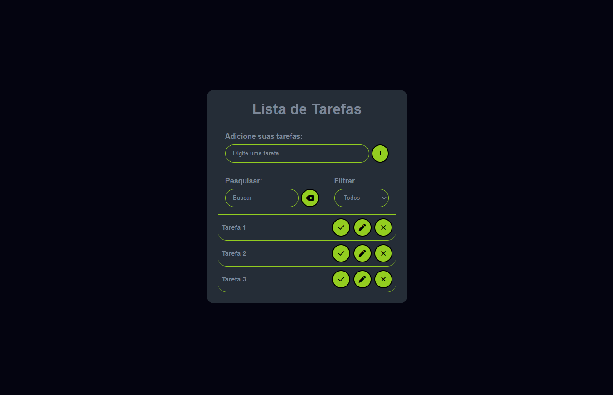

# To-Do List Avançada.
## Visão Geral

### Projeto de uma aplicação de lista de tarefas interativa, onde você consegue adicionar suas tarefas diárias de forma prática e bem intuitiva. 
#




## Construido com:
- HTML Semântico
- CSS Default
- JavaScript

## Funcionalidades
- Adicionar quantas tarefas quiser.
- Botões dedicados de: Finalizar tarefa; Editar e excluir;
- Campo de pesquisa de tarefas.
- Filtro de tarefas: Feitas; À fazer; e Todas as tarefas;


## O que eu aprendi:
- Manipulação do DOM com:
```js
  document.querySelector('.main-container')
  document.querySelectorAll('.btn')
  document.getElementById('submit')
```
- laços de repetição
```js
  rates.forEach(rate => {})
```
- Eventos
```js
  submitButton.addEventListener('click', () => {})
```
- Boas práticas com JavaScript

## Link

Veja o projeto aqui: [Acessar🌍](https://devhiderlan.github.io/To-Do-List-Avancada/)

## Autor

Hiderlan Santana: [Linkedin](https://www.linkedin.com/in/hiderlan-santana/)